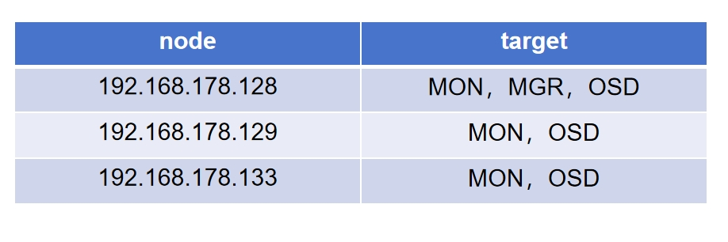

# ChatStoreHub

## 部署步骤
### nginx
各个节点安装nginx:

```shell
cd prerequisites
sudo ./install_nginx.sh
```


### ceph([详细文档](https://docs.ceph.com/en/reef/))

在128上安装cephadm:
```shell
cd prerequisites
sudo ./install_cephadm.sh
```
执行：
```shell
sudo cephadm bootstrap --mon-ip 192.168.178.128
```
查看集群状态:
```shell
sudo cephadm shell -- ceph -s
```
为其他服务器添加公钥：
```shell
cat /etc/ceph/ceph.pub
ssh-copy-id -f -i /etc/ceph/ceph.pub root@192.168.178.129
ssh-copy-id -f -i /etc/ceph/ceph.pub root@192.168.178.133
```
为集群添加服务器：
```shell
sudo cephadm shell -- ceph orch host add node2 192.168.178.129
sudo cephadm shell -- ceph orch host add node3 192.168.178.133
```
将三台主机设置为MON服务：
```shell
sudo cephadm shell -- ceph orch apply mon --unmanaged # 关闭MON自动部署
sudo cephadm shell -- ceph orch daemon add mon node2:192.168.178.129
sudo cephadm shell -- ceph orch daemon add mon node3:192.168.178.133
```