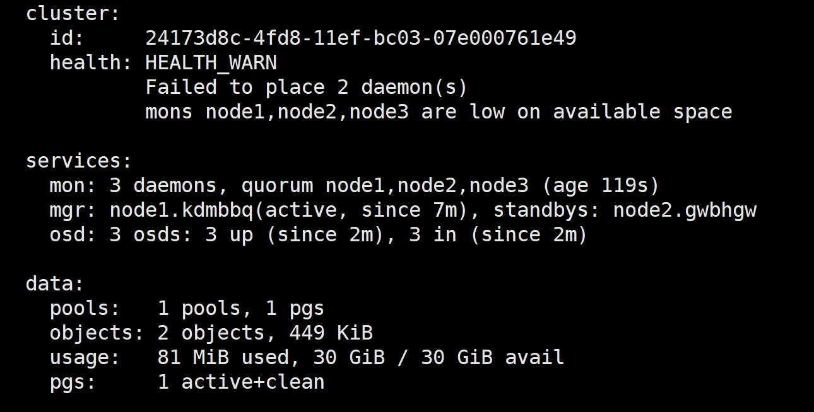

# ChatStoreHub
## introduction
ChatStoreHub is a chat server based on the WebSocket protocol. It provides a simple and efficient way to store and retrieve chat messages.


## 部署步骤
### prerequisites
```shell
sudo apt-get install -y libmicrohttpd-dev libmysqlclient-dev mysql-server
```
### nginx
各个节点安装nginx:

```shell
cd prerequisites
sudo ./install_nginx.sh
```

### ceph([文档链接](https://docs.ceph.com/en/reef/))

在128上安装cephadm:
```shell
cd prerequisites
sudo ./install_cephadm.sh
```
执行：
```shell
sudo cephadm bootstrap --mon-ip 192.168.46.128
```
查看集群状态:
```shell
sudo cephadm shell -- ceph -s
```

为其他服务器添加公钥：
```shell
cat /etc/ceph/ceph.pub
ssh-copy-id -f -i /etc/ceph/ceph.pub root@192.168.46.129
ssh-copy-id -f -i /etc/ceph/ceph.pub root@192.168.46.130
```
为集群添加服务器：
```shell
sudo cephadm shell -- ceph orch host add node2 192.168.46.129
sudo cephadm shell -- ceph orch host add node3 192.168.46.130
```
将三台主机设置为MON服务：
```shell
sudo cephadm shell -- ceph orch apply mon --unmanaged # 关闭MON自动部署
sudo cephadm shell -- ceph orch daemon add mon node2:192.168.46.129
sudo cephadm shell -- ceph orch daemon add mon node3:192.168.46.130
```
查看目前集群状态，显示为：

部署OSD：(根据实际磁盘情况部署)
```shell
sudo cephadm shell -- ceph orch daemon add osd node1:/dev/sdb
sudo cephadm shell -- ceph orch daemon add osd node2:/dev/sdb
sudo cephadm shell -- ceph orch daemon add osd node3:/dev/sdb
```
查看目前集群状态，显示为：

创建cephfs：
```shell
sudo cephadm shell -- ceph fs volume create cephfs
```
查看目前集群状态，显示为：

安装Librados库：
```shell
sudo apt-get install librados-dev
```


备注：
关闭所有服务：
sudo systemctl stop --all ceph\*.service ceph\*.target
开启所有服务：
sudo systemctl start --all ceph*.service ceph*.target

### backend
```shell
cd backend
./build.sh
cd ..
./run_nginx.sh
```